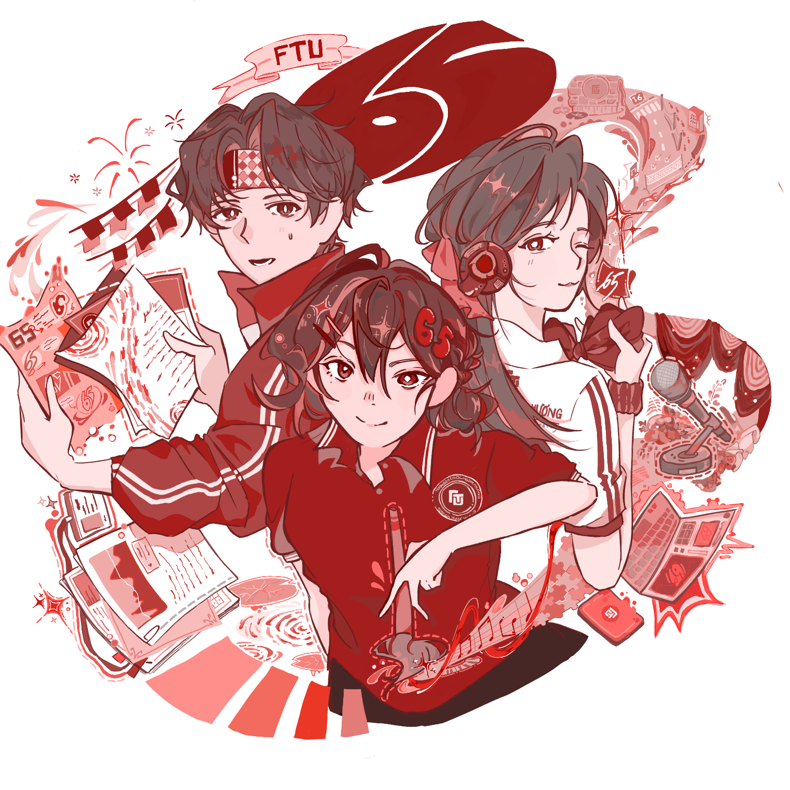
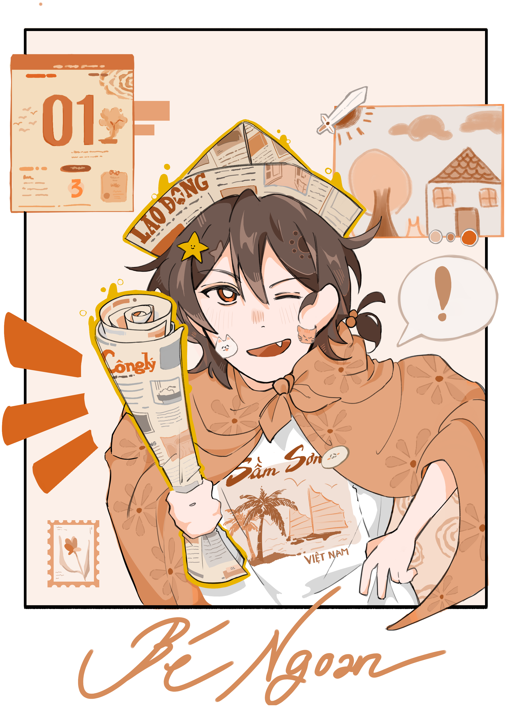
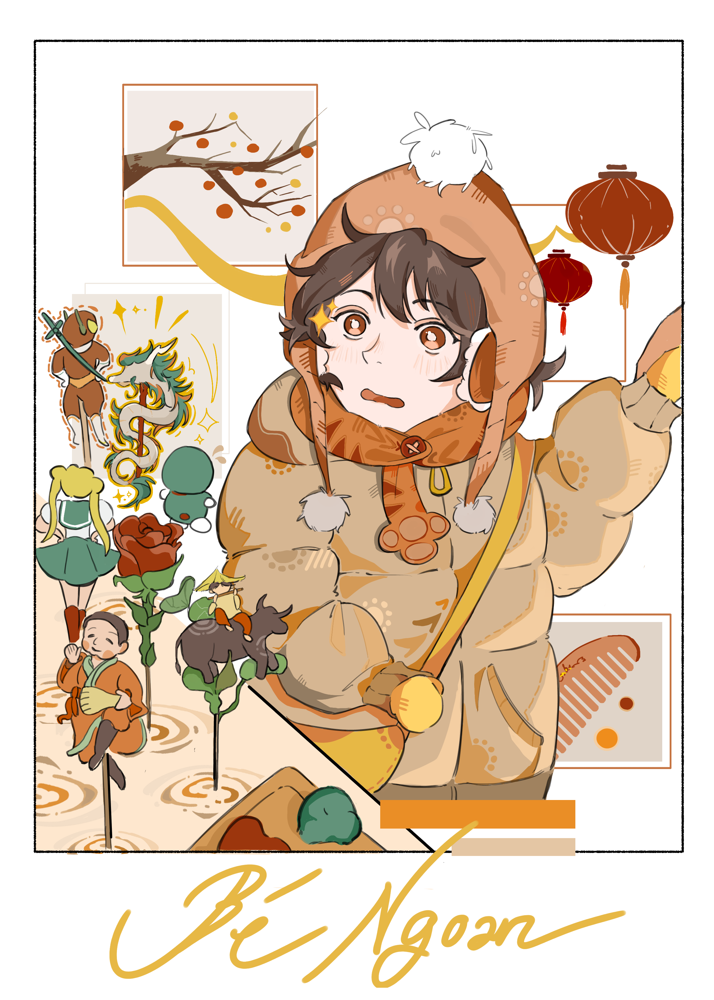
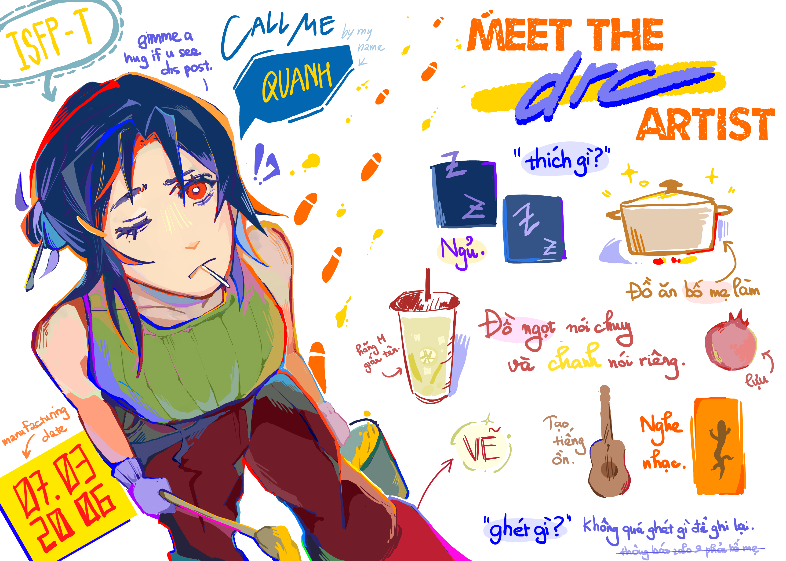
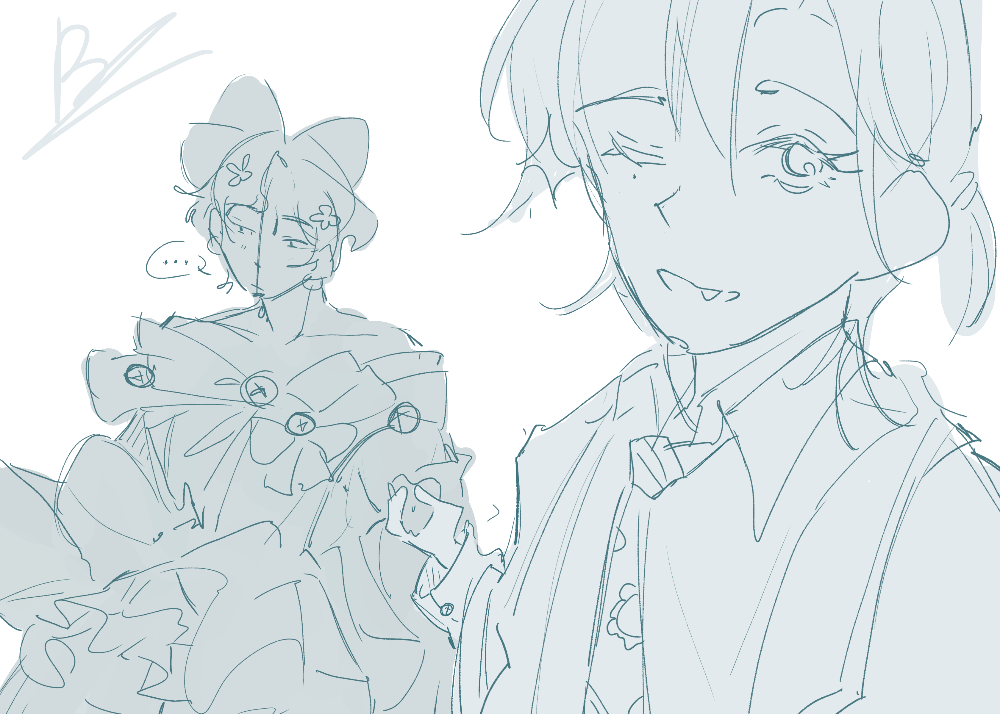
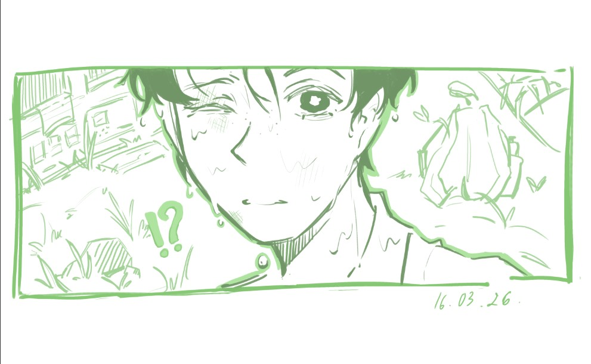

  

 

# 💫 About Me:
A second-year student with an interest in music and art.

## 🌐 Socials:
   

# 💻 Tech Stack:
     

## 🎨 My Digital Artwork

### 🌼 My first completed digital artwork

  

---

### ✨ Continuing my digital art journey

  
  

---

### 🎀 Ideas

  
  
  

---

