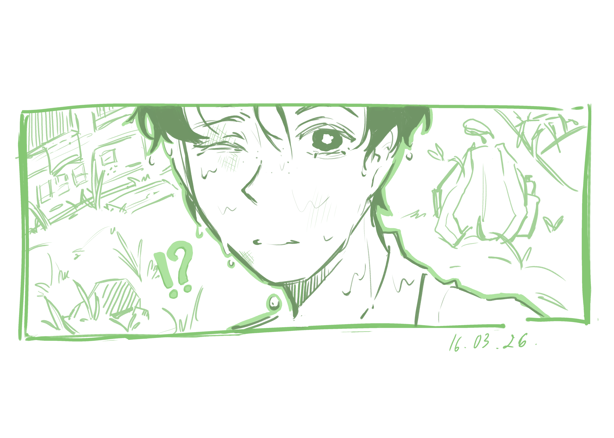

  

 

# 💫 About Me:
<h1 align="center">Nguyễn Quỳnh Anh 🍋</h1>

  A second-year International Business student who enjoys drawing

## 🌐 Socials:
   

# 💻 Tech Stack:
     

## 🎨 My Digital Artwork

### 🌼 My first completed digital artwork
My first completed digital artwork, created for the 65th anniversary competition of my university, where it received an award in the Art category. Please excuse the slightly awkward composition — I was still figuring things out at the time ^^

  

---

### ✨ Continuing my digital art journey
My second and third completed digital pieces, created as part of my application for the university’s Art Club. Thankfully, they worked — I’m now a member of the club’s Professional Department thanks to these works.

  
  

---

### 🎀 Ideas
A collection of random pieces across different styles and ideas. I’m still learning, experimenting, and trying to make my art a little more “pleasant to look at” each time.

  
  
  

